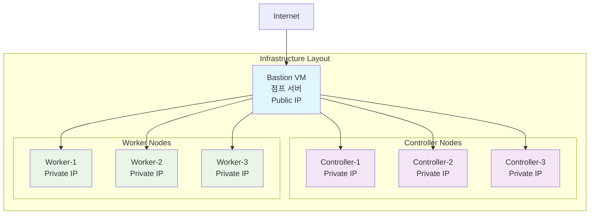

# 2025 OpenInfra Days Korea - k0s Kubernetes Hands-on Lab

본 프로젝트는 **2025 OpenInfra Days Korea**의 발표 목적으로 작성된 hands-on lab입니다.

## 🎯 목표

k0s를 활용하여 Kubernetes를 설치하고 운영하는 방법을 실습을 통해 학습합니다.

## 📋 실습 구성

### 인프라 환경
- VM 6대
- 초기 구성: Controller 1대 + Worker 1대
- 확장 구성: Controller 3대 + Worker 3대 (2대 추가)

### 실습 단계

1. **[Step 1] k0s 클러스터 초기 설치 (v1.31)**
   - Controller 노드 1대 설치
   - Worker 노드 1대 설치
   - k0sctl CLI 및 YAML 설정 활용

2. **[Step 2] 클러스터 확장**
   - Controller 노드 2대 추가 (총 3대)
   - Worker 노드 2대 추가 (총 3대)
   - 동적 노드 추가 방법 실습

3. **[Step 3] Kubernetes 버전 업그레이드**
   - v1.31 → v1.33 업그레이드
   - `updateconfig` 활용한 안전한 업그레이드

4. **[Step 4] 모니터링 시스템 구성**
   - Prometheus Operator 설치
   - Grafana 대시보드 구성
   - 시스템 컴포넌트 모니터링

5. **[Step 5] FluxCD로 sampleapp 배포 (OCI 아티팩트 기반)**
  - Docker 이미지와 매니페스트를 GHCR로 푸시
  - Flux가 OCI digest 변경을 감지하고 자동 적용

## 🔧 사전 준비

### 필수 요구사항
- VM 6대(k0s 설치용)
- SSH 클라이언트

### Bastion → 각 VM SSH 사전 구성 (중요)
`k0sctl`은 Bastion에서 각 Controller/Worker VM로 **비대화식 SSH 접속**이 가능해야 동작합니다. 따라서 실습 시작 전에 Bastion VM에 SSH 키와 SSH config를 준비해 두어야 합니다.

두 가지 시나리오 중 자신의 환경에 맞는 방법을 선택하세요.

#### 1) azd 템플릿으로 VM을 배포한 경우 (자동 구성)
- `azd up` 시 Bastion VM 내부에 `/home/azureuser/.ssh/bastion_key` (개인키) 가 자동 생성되고, 모든 대상 VM에 공개키가 배포됩니다.
- `/home/azureuser/.ssh/config` 파일에 `vm1` ~ `vm6` Alias가 설정되어 있으므로 단순히 `ssh vm1` 형태로 접속 가능합니다.
- 점검:
  ```bash
  ls -l ~/.ssh/bastion_key
  grep -A3 vm1 ~/.ssh/config
  ssh -o BatchMode=yes vm1 'echo ok'
  ```

#### 2) 수동/기존 인프라(VM 직접 생성) 환경 (수동 구성 필요)
1. Bastion VM에 SSH 키 생성
   ```bash
   ssh-keygen -t ed25519 -f ~/.ssh/bastion_key -C "k0s-bastion" -N ""
   # 또는 RSA 필요 시: ssh-keygen -t rsa -b 4096 -f ~/.ssh/bastion_key -N ""
   chmod 600 ~/.ssh/bastion_key
   ```
2. 공개키를 각 VM(Controller + Worker) 에 배포 (패스워드 로그인 1회 필요)
   ```bash
   # 예시 IP (환경에 맞게 수정)
   for IP in 10.0.0.4 10.0.0.5 10.0.0.6 10.0.0.7 10.0.0.8 10.0.0.9; do \
     ssh-copy-id -i ~/.ssh/bastion_key.pub azureuser@"$IP"; \
   done
   ```
3. SSH config 작성 (Alias 제공)
   ```bash
   cat >> ~/.ssh/config <<'EOF'
   Host vm1
     HostName 10.0.0.4
     User azureuser
     IdentityFile ~/.ssh/bastion_key
     StrictHostKeyChecking accept-new
   Host vm2
     HostName 10.0.0.5
     User azureuser
     IdentityFile ~/.ssh/bastion_key
     StrictHostKeyChecking accept-new
   Host vm3
     HostName 10.0.0.6
     User azureuser
     IdentityFile ~/.ssh/bastion_key
     StrictHostKeyChecking accept-new
   Host vm4
     HostName 10.0.0.7
     User azureuser
     IdentityFile ~/.ssh/bastion_key
     StrictHostKeyChecking accept-new
   Host vm5
     HostName 10.0.0.8
     User azureuser
     IdentityFile ~/.ssh/bastion_key
     StrictHostKeyChecking accept-new
   Host vm6
     HostName 10.0.0.9
     User azureuser
     IdentityFile ~/.ssh/bastion_key
     StrictHostKeyChecking accept-new
   EOF
   chmod 600 ~/.ssh/config
   ```
4. 접속 테스트
   ```bash
   for H in vm1 vm2 vm3 vm4 vm5 vm6; do ssh -o BatchMode=yes "$H" 'echo OK from $(hostname)'; done
   ```

#### k0sctl.yaml 에서의 keyPath
`k0sctl.yaml` 의 각 host 항목에 `keyPath: ~/.ssh/bastion_key` 로 지정되어 있어야 하며, 위 준비가 끝난 뒤에야 `k0sctl apply` 가 정상 동작합니다.

> 만약 별도 키 이름/경로를 사용했다면 `k0sctl.yaml` 의 `keyPath` 를 동일하게 맞추세요.

### Optional
- VS Code + Azure Developer CLI Extension
- Linux 환경(bastion VM)
- VM spec: 2Core / 4Gb (minimum) 

## 🚀 시작하기

### 사전 준비: VM 인프라 구성

실습을 위해 다음과 같은 VM 환경이 구성되어야 합니다:



**VM 구성 요약:**
- **Bastion VM 1대**: SSH 접근을 위한 점프 서버 (Public IP)
- **Controller 노드 3대**: k0s 마스터 노드 (Private IP)
- **Worker 노드 3대**: k0s 워커 노드 (Private IP)

<details>
<summary><strong>🔧 Azure VM 자동 배포 방법 (옵션)</strong></summary>

Azure Developer CLI(azd)를 사용하여 VM 환경을 자동으로 배포할 수 있습니다:

```bash
# 프로젝트 클론
git clone <repository-url>
cd 2025_openinfradays_k0s

# Azure 로그인
az login

# azd 디렉토리로 이동
cd azd

# 배포 전 검증
./validate-deployment.sh

# 인프라 배포
azd up
```

자세한 Azure 배포 방법은 [`azd/README.md`](azd/README.md)를 참고하세요.

**참고:** 기존에 Azure VM 환경이 준비되어 있다면 이 단계는 건너뛰어도 됩니다.

</details>

### 1. k0s 설치 및 설정

#### k0sctl 설치
가장 간단한 설치 (최신 릴리스 자동):

```bash
curl -sSL -o k0sctl https://github.com/k0sproject/k0sctl/releases/latest/download/k0sctl-linux-amd64
chmod +x k0sctl
sudo mv k0sctl /usr/local/bin/
k0sctl version
```

ARM (aarch64) 환경이거나 아키텍처 자동 감지를 원한다면:

```bash
ARCH=$(uname -m)
case $ARCH in
  x86_64|amd64) ARCH=amd64 ;;
  aarch64|arm64) ARCH=arm64 ;;
  armv7l|armv8l|arm) ARCH=armv7 ;;
  *) echo "Unsupported arch: $ARCH" && exit 1 ;;
esac
curl -sSL -o k0sctl "https://github.com/k0sproject/k0sctl/releases/latest/download/k0sctl-linux-${ARCH}"
chmod +x k0sctl && sudo mv k0sctl /usr/local/bin/
k0sctl version
```

설치 후 `k0sctl version` 출력이 정상적으로 나오면 다음 단계로 진행합니다.

#### 초기 클러스터 설정 (v1.31)

1. **k0sctl.yaml 설정 파일 생성**

참고: 레포지토리에 `k0s/k0sctl.yaml` 예제가 포함되어 있습니다. Bastion VM에서 실행할 것을 가정하며, azd 배포의 기본 IP 매핑은 `vm1=10.0.0.4` … `vm6=10.0.0.9` 입니다. Bastion에서 워커로 접속하는 키 경로는 `~/.ssh/bastion_key`입니다.

```yaml
apiVersion: k0sctl.k0sproject.io/v1beta1
kind: Cluster
metadata:
  name: k0s-cluster
spec:
  hosts:
  # Controller 노드 1대
  - ssh:
      address: <controller-1-ip>
      user: azureuser
      keyPath: ~/.ssh/bastion_key
    role: controller
    hostname: controller-1
    installFlags:
    # controller node metric scarpe를 위한 설정
    - "--enable-metrics-scraper"
    # controller node에 worker 역할도 추가하는 flag로 운영환경에서는 사용 하지 않도록 권고
    - "--enable-worker"  
  # Worker 노드 1대
  - ssh:
      address: <worker-1-ip>
      user: azureuser
      keyPath: ~/.ssh/bastion_key
    role: worker
    hostname: worker-1
  k0s:
    version: v1.33.2+k0s.0
    config:
      apiVersion: k0s.k0s.io/v1beta1
      kind: ClusterConfig
      metadata:
        name: k0s
      spec:
        # konnectivity port 기본설정
        konnectivity:
          adminPort: 8133
          agentPort: 8132
        network:
          provider: calico
          calico:
            envVars:              
              CALICO_IPV4POOL_CIDR: "10.244.0.0/16"
              CALICO_DISABLE_FILE_LOGGING: "true"
              FELIX_DEFAULTENDPOINTTOHOSTACTION: "ACCEPT"
              FELIX_LOGSEVERITYSCREEN: "info"
              FELIX_HEALTHENABLED: "true"
              FELIX_PROMETHEUSMETRICSENABLED: "true"
              FELIX_FEATUREDETECTOVERRIDE: "ChecksumOffloadBroken=true"
              FELIX_IPV6SUPPORT: "false"
        # Persistently manage Traefik with k0s helm extensions to avoid uninstall on re-apply
        extensions:
          helm:
            concurrencyLevel: 5
            repositories:
            - name: traefik
              url: https://traefik.github.io/charts
            - name: bitnami
              url: https://charts.bitnami.com/bitnami
            - name: stable
              url: https://charts.helm.sh/stable
            - name: prometheus-community
              url: https://prometheus-community.github.io/helm-charts
            - name: grafana
              url: https://grafana.github.io/helm-charts
            charts:
            # ingress
            - name: traefik
              chartname: traefik/traefik
              version: "v37.0.0"
              namespace: traefik-v2
            # Prometheus + Grafana (kube-prometheus-stack) for cluster monitoring
            - name: prometheus-stack
              chartname: prometheus-community/prometheus-stack
              version: "76.2.0"
              namespace: monitoring
```


2. **클러스터 배포**

```bash
# 클러스터 설치
k0sctl apply --config k0sctl.yaml

# kubeconfig 가져오기
k0sctl kubeconfig --config k0sctl.yaml > kubeconfig

# kubectl 설정
sudo snap install kubectl --classic
export KUBECONFIG=$(pwd)/kubeconfig
kubectl get nodes
```

> #### [Why doesn't kubectl get nodes list the k0s controllers?](https://docs.k0sproject.io/stable/troubleshooting/FAQ/#why-doesnt-kubectl-get-nodes-list-the-k0s-controllers)
> As a default, the control plane does not run kubelet at all, and will not accept any workloads, so the controller will not show up on the node list in kubectl. If you want your controller to accept workloads and run pods, you do so with: k0s controller --enable-worker (recommended only as test/dev/POC environments).

> #### k0s에서의 helm chart 설치
> k0s 는 kube-system 네임스페이스의 chart crd를 이용해서 설치 목록을 관리하고 있어 위에서 설치한 helm chart(trafik, prometheus)는 
> helm list로 보이지 않습니다.
> 목록을 확인하려면 아래와 같이 crd를 통해 확인이 가능합니다.
> 
> ```bash
> $ kubectl -n kube-system get charts.helm.k0sproject.io
> NAME                               AGE
> k0s-addon-chart-prometheus-stack   168m
> k0s-addon-chart-traefik            168m
> 
> $ kubectl -n kube-system describe chart k0s-addon-chart-prometheus-stack
> ```


### 2. 클러스터 확장 (노드 추가)

k0sctl.yaml 파일에 Controller, Worker 노드 2대씩 추가(/k0s/ksctl.yaml 주석 참고)
```yaml
...
  # Controller 노드 2대 추가
  - ssh:
      address: 10.0.0.6
      user: azureuser
      keyPath: ~/.ssh/bastion_key
    role: controller
    hostname: controller-2
    installFlags:
    - "--enable-metrics-scraper"
  - ssh:
      address: 10.0.0.8
      user: azureuser
      keyPath: ~/.ssh/bastion_key
    role: controller
    hostname: controller-3
    installFlags:
    - "--enable-metrics-scraper"
...
  # worker 노드 2대 추가
  - ssh:
      address: 10.0.0.5
      user: azureuser
      keyPath: ~/.ssh/bastion_key
    role: worker
    hostname: worker-2
  - ssh:
      address: 10.0.0.9
      user: azureuser
      keyPath: ~/.ssh/bastion_key
    role: worker
    hostname: worker-3
```


```bash
# 클러스터 업데이트
k0sctl apply --config k0sctl.yaml

# 노드 확인
kubectl get nodes
```

### 3. Kubernetes 버전 업그레이드 (v1.31 → v1.33)

```yaml
# k0sctl.yaml에서 버전 변경 (예: v1.33.3)
k0s:
  version: v1.33.3+k0s.0
```

```bash
# 업그레이드 실행
k0sctl apply --config k0sctl.yaml

# 업그레이드 상태 확인
kubectl get nodes -o wide
```

### 4. [모니터링 시스템 구성](https://docs.k0sproject.io/stable/system-monitoring/)

#### Step 1: k0s 시스템 모니터링 활성화(이미 완료, 만일 설정이 안 된 경우 아래와 같이 수행)

k0s의 내장 시스템 컴포넌트 모니터링을 활성화합니다:

```bash
# Controller 노드에서 metrics scraper 활성화
# k0sctl.yaml 파일의 controller 노드 설정에 `--enable-metrics-scraper`
# 또는 각 node에서 다음과 같이 실행

sudo k0s stop
sudo k0s install controller --enable-metrics-scraper
sudo k0s start
```


#### Step 2: k0s ServiceMonitor 생성 (선택)

k0s 시스템 컴포넌트를 Prometheus가 수집할 수 있도록 ServiceMonitor를 생성합니다:

```bash
# ServiceMonitor 생성
cat <<EOF | kubectl apply -f -
apiVersion: monitoring.coreos.com/v1
kind: ServiceMonitor
metadata:
  name: k0s-system-monitoring
  namespace: k0s-system
  labels:
    app: k0s-observability
spec:
  endpoints:
  - port: http
    path: /metrics
    interval: 30s
  selector:
    matchLabels:
      app: k0s-observability
      component: pushgateway
      k0s.k0sproject.io/stack: metrics
EOF
```

#### Step 3: 클러스터 업데이트 및 확인

```bash
# k0s pushgateway 확인
kubectl get all -n k0s-system
kubectl get servicemonitor -n k0s-system

# (선택) kube-prometheus-stack를 extensions로 추가했다면, Prometheus 및 Grafana 상태 확인
kubectl get pods -n monitoring
kubectl get svc -n monitoring
```

#### Step 4: Grafana 대시보드 접근 (kube-prometheus-stack 사용 시)

```bash
# Grafana 관리자 패스워드 확인
kubectl get secret --namespace monitoring kube-prometheus-stack-grafana \
  -o jsonpath="{.data.admin-password}" | base64 --decode

# 포트 포워딩으로 Grafana 접근
kubectl port-forward --namespace monitoring svc/kube-prometheus-stack-grafana 3000:80
```

브라우저에서 `http://localhost:3000` 접근
- Username: `admin`
- Password: 위에서 확인한 패스워드

#### Step 5: k0s 시스템 컴포넌트 모니터링 확인

Grafana에서 다음 메트릭들을 확인할 수 있습니다:

**모니터링되는 k0s 시스템 컴포넌트:**
- `kube-scheduler` - Kubernetes 스케줄러 메트릭
- `kube-controller-manager` - 컨트롤러 매니저 메트릭  
- `etcd` - etcd 데이터베이스 메트릭
- `kine` - k0s의 경량 데이터 저장소 메트릭

**대시보드 import**
1. grafana
2. node exporter


### 5. FluxCD로 sampleapp 배포 (OCI 아티팩트 기반)

다음이 자동으로 수행됩니다:
- sampleapp Docker 이미지가 GHCR로 빌드/푸시 (ghcr.io/<owner>/<repo>)
- 앱 매니페스트(Deployment/Service/kustomization/namespace)가 이미지 digest(@sha256:…)로 고정되어 번들(tar.gz)되고 GHCR에 OCI 아티팩트로 푸시 (ghcr.io/<owner>/<repo>-manifests:latest)
- Flux의 OCIRepository가 latest 태그의 digest 변경을 감지하면 Kustomization이 ./app 경로를 reconcile하여 자동 적용

사전 준비 (k0s 클러스터에서 1회):

```bash
# Flux 설치 (CRDs 포함)
flux install

# flux-system 네임스페이스 없으면 생성
kubectl create ns flux-system --dry-run=client -o yaml | kubectl apply -f -

# 부트스트랩 리소스 적용 (OCIRepository/Kustomization)
kubectl apply -f fluxcd/bootstrap/flux-bootstrap.yaml

# 상태 확인
kubectl -n flux-system get ocirepositories.source.toolkit.fluxcd.io
kubectl -n flux-system get kustomizations.kustomize.toolkit.fluxcd.io
```

수동 테스트(선택):

```bash
# 로컬에서 kustomize로 렌더링 후 적용 (네임스페이스 및 앱 리소스)
kubectl apply -k fluxcd/app

# 리소스 확인
kubectl -n app get deploy,svc
```

문제 해결:
- GHCR가 프라이빗이면 Flux에서 레지스트리 인증(Secret + ServiceAccount) 구성이 필요합니다.
- 외부 노출이 필요하면 Service 타입을 LoadBalancer로 변경하거나 Ingress 리소스를 추가하세요.
- GitHub Actions가 매니페스트 OCI 아티팩트를 갱신하면 Flux가 digest 변경을 감지해 자동으로 reconcile 합니다.


### 6. k0s 삭제
```bash
k0sctl reset --config k0sctl.yaml

# 또는 각 vm에 접속해서 k0s service를 중지&제거합니다.
sudo k0s stop
sudo k0s reset
```

## k0s 추가 활용 팁   
- [**auto update**](https://docs.k0sproject.io/stable/autopilot/)
- [**runtime 교체**](https://docs.k0sproject.io/stable/runtime/)
- [**cni plugin**](https://docs.k0sproject.io/stable/networking/)
- - k0s는 기본으로 Kube-router / Calico 를 지원합니다.
- - cloud provider(azure cni 등)를 활용하려면 [다음](https://docs.k0sproject.io/stable/cloud-providers/)을 참고합니다.
- [**csi plugin**](https://docs.k0sproject.io/stable/storage/)
- - storage를 사용하기 위해서는 csi driver를 설치합니다.
- **ingress**
- - [nginx](https://docs.k0sproject.io/stable/examples/nginx-ingress/)
- - [traefik](https://docs.k0sproject.io/stable/examples/traefik-ingress/)

## 🤝 기여하기

이슈나 개선사항이 있으시면 언제든지 Pull Request를 보내주세요!

## 📄 라이선스

이 프로젝트는 Apache License 2.0 하에 배포됩니다. 자세한 내용은 [LICENSE](LICENSE) 파일을 참고하세요.

## 📚 참고 자료

### k0s 관련
- [k0s 공식 문서](https://docs.k0sproject.io/)
- [k0sctl 가이드](https://docs.k0sproject.io/stable/k0sctl-install/)

### 모니터링
- [Prometheus Operator](https://prometheus-operator.dev/)
- [Grafana 대시보드](https://grafana.com/grafana/dashboards/)

### Traefik
- [Traefik 공식 문서](https://doc.traefik.io/traefik/)

---

**2025 OpenInfra Days Korea** 발표를 위한 프로젝트입니다.
