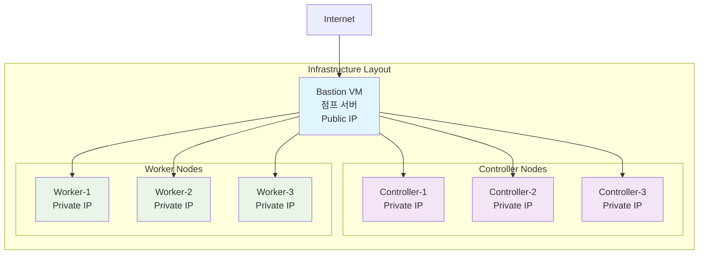

# 2025 OpenInfra Days Korea - k0s Kubernetes Hands-on Lab

본 프로젝트는 **2025 OpenInfra Days Korea**의 발표 목적으로 작성된 hands-on lab입니다.

## 🎯 목표

k0s를 활용하여 Kubernetes를 설치하고 운영하는 방법을 실습을 통해 학습합니다.

## 📋 실습 구성

### 인프라 환경
- Azure VM 6대 (기 구성된 환경 - `azd` 디렉토리 참고)
- 초기 구성: Controller 3대 + Worker 1대
- 확장 구성: Controller 3대 + Worker 3대 (2대 추가)

### 실습 단계

1. **[Step 1] k0s 클러스터 초기 설치 (v1.31)**
   - Controller 노드 3대 설치
   - Worker 노드 1대 설치
   - k0sctl CLI 및 YAML 설정 활용

2. **[Step 2] 클러스터 확장**
   - Worker 노드 2대 추가 (총 3대)
   - 동적 노드 추가 방법 실습

3. **[Step 3] Kubernetes 버전 업그레이드**
   - v1.31 → v1.33 업그레이드
   - `updateconfig` 활용한 안전한 업그레이드

4. **[Step 4] Traefik Ingress Controller 설치**
   - 외부 트래픽 라우팅 설정
   - 서비스 노출 및 도메인 매핑

5. **[Step 5] 모니터링 시스템 구성**
   - Prometheus Operator 설치
   - Grafana 대시보드 구성
   - 시스템 컴포넌트 모니터링

## 🔧 사전 준비

### 필수 요구사항
- Azure 계정 및 구독
- Azure CLI 설치
- Azure Developer CLI (azd) 설치
- SSH 클라이언트

### 권장 환경
- VS Code + Azure Developer CLI Extension
- Linux/macOS/WSL2 환경
- VM spec: 2Core / 4Gb (minimum) 

## 🚀 시작하기

### 사전 준비: Azure VM 인프라 구성

실습을 위해 다음과 같은 VM 환경이 구성되어야 합니다:



**VM 구성 요약:**
- **Bastion VM 1대**: SSH 접근을 위한 점프 서버 (Public IP)
- **Controller 노드 3대**: k0s 마스터 노드 (Private IP)
- **Worker 노드 3대**: k0s 워커 노드 (Private IP)

<details>
<summary><strong>🔧 Azure VM 자동 배포 방법 (옵션)</strong></summary>

Azure Developer CLI(azd)를 사용하여 VM 환경을 자동으로 배포할 수 있습니다:

```bash
# 프로젝트 클론
git clone <repository-url>
cd 2025_openinfradays_k0s

# Azure 로그인
az login

# azd 디렉토리로 이동
cd azd

# 배포 전 검증
./validate-deployment.sh

# 인프라 배포
azd up
```

자세한 Azure 배포 방법은 [`azd/README.md`](azd/README.md)를 참고하세요.

**참고:** 기존에 Azure VM 환경이 준비되어 있다면 이 단계는 건너뛰어도 됩니다.

</details>

### 1. k0s 설치 및 설정

#### k0sctl 설치

```bash
wget https://github.com/k0sproject/k0sctl/releases/download/dev/k0sctl-linux-amd64
chmod +x k0sctl-linux-amd64
sudo mv k0sctl-linux-amd64 /usr/local/bin/k0sctl
```

#### 초기 클러스터 설정 (v1.31)

1. **k0sctl.yaml 설정 파일 생성**

```yaml
apiVersion: k0sctl.k0sproject.io/v1beta1
kind: Cluster
metadata:
  name: k0s-cluster
spec:
  hosts:
  # Controller 노드 3대
  - ssh:
      address: <controller-1-ip>
      user: azureuser
      keyPath: ~/.ssh/id_rsa
    role: controller
    hostname: controller-1
  - ssh:
      address: <controller-2-ip>
      user: azureuser
      keyPath: ~/.ssh/id_rsa
    role: controller
    hostname: controller-2
  - ssh:
      address: <controller-3-ip>
      user: azureuser
      keyPath: ~/.ssh/id_rsa
    role: controller
    hostname: controller-3
  # Worker 노드 1대
  - ssh:
      address: <worker-1-ip>
      user: azureuser
      keyPath: ~/.ssh/id_rsa
    role: worker
    hostname: worker-1
  k0s:
    version: v1.31.10+k0s.0
    config:
      apiVersion: k0s.k0s.io/v1beta1
      kind: ClusterConfig
      metadata:
        name: k0s
      spec:
        network:
          serviceCIDR: "10.96.0.0/12"
          podCIDR: "10.244.0.0/16"
        controllerManager:
          extraArgs:
            bind-address: "0.0.0.0"
        scheduler:
          extraArgs:
            bind-address: "0.0.0.0"
```

2. **클러스터 배포**

```bash
# 클러스터 설치
k0sctl apply --config k0sctl.yaml

# kubeconfig 가져오기
k0sctl kubeconfig --config k0sctl.yaml > kubeconfig

# kubectl 설정

export KUBECONFIG=$(pwd)/kubeconfig
kubectl get nodes
```

> ### [Why doesn't kubectl get nodes list the k0s controllers?](https://docs.k0sproject.io/stable/troubleshooting/FAQ/#why-doesnt-kubectl-get-nodes-list-the-k0s-controllers)
> As a default, the control plane does not run kubelet at all, and will not accept any workloads, so the controller will not show up on the node list in kubectl. If you want your controller to accept workloads and run pods, you do so with: k0s controller --enable-worker (recommended only as test/dev/POC environments).

### 2. 클러스터 확장 (Worker 노드 추가)

k0sctl.yaml 파일에 Worker 노드 2대 추가:

```yaml
  # 기존 구성에 추가
  - ssh:
      address: <worker-2-ip>
      user: azureuser
      keyPath: ~/.ssh/id_rsa
    role: worker
    hostname: worker-2
  - ssh:
      address: <worker-3-ip>
      user: azureuser
      keyPath: ~/.ssh/id_rsa
    role: worker
    hostname: worker-3
```

```bash
# 클러스터 업데이트
k0sctl apply --config k0sctl.yaml

# 노드 확인
kubectl get nodes
```

### 3. Kubernetes 버전 업그레이드 (v1.31 → v1.33)

```yaml
# k0sctl.yaml에서 버전 변경
k0s:
  version: v1.33.0+k0s.0
```

```bash
# 업그레이드 실행
k0sctl apply --config k0sctl.yaml

# 업그레이드 상태 확인
kubectl get nodes -o wide
```

### 4. Traefik Ingress Controller 설치

k0s extension을 사용하여 Traefik을 설치합니다:

k0sctl.yaml 파일의 k0s 설정 부분에 extensions를 추가:

```yaml
  k0s:
    config:
      spec:
        extensions:
          helm:
            repositories:
            - name: traefik
              url: https://traefik.github.io/charts
            - name: bitnami
              url: https://charts.bitnami.com/bitnami
            charts:
            - name: traefik
              chartname: traefik/traefik
              version: "20.5.3"
              namespace: default
            - name: metallb
              chartname: bitnami/metallb
              version: "2.5.4"
              namespace: default
              values: |
                configInline:
                  address-pools:
                  - name: generic-cluster-pool
                    protocol: layer2
                    addresses:
                    - 192.168.0.5-192.168.0.10
```

```bash
# 설정 적용
k0sctl apply --config k0sctl.yaml

# Traefik 설치 확인
kubectl get pods -n traefik
kubectl get svc -n traefik
```

### 5. [모니터링 시스템 구성](https://docs.k0sproject.io/stable/system-monitoring/)

#### Step 1: k0s 시스템 모니터링 활성화

k0s의 내장 시스템 컴포넌트 모니터링을 활성화합니다:

```bash
# Controller 노드에서 metrics scraper 활성화
# k0sctl.yaml 파일의 controller 노드 설정에 `--enable-metrics-scraper`
# 또는 각 node에서 다음과 같이 실행

sudo k0s stop
sudo k0s install controller --enable-metrics-scraper
sudo k0s start
```


#### Step 2: k0s ServiceMonitor 생성

k0s 시스템 컴포넌트를 Prometheus가 수집할 수 있도록 ServiceMonitor를 생성합니다:

```bash
# ServiceMonitor 생성
cat <<EOF | kubectl apply -f -
apiVersion: monitoring.coreos.com/v1
kind: ServiceMonitor
metadata:
  name: k0s-system-monitoring
  namespace: k0s-system
  labels:
    app: k0s-observability
spec:
  endpoints:
  - port: http
    path: /metrics
    interval: 30s
  selector:
    matchLabels:
      app: k0s-observability
      component: pushgateway
      k0s.k0sproject.io/stack: metrics
EOF
```

#### Step 3: 클러스터 업데이트 및 확인

```bash
# 설정 적용
k0sctl apply --config k0sctl.yaml

# k0s pushgateway 확인
kubectl get all -n k0s-system
kubectl get servicemonitor -n k0s-system

# Prometheus 및 Grafana 설치 확인
kubectl get all -n monitoring
```

#### Step 4: Grafana 대시보드 접근

```bash
# Grafana 관리자 패스워드 확인
kubectl get secret --namespace monitoring kube-prometheus-stack-grafana \
  -o jsonpath="{.data.admin-password}" | base64 --decode

# 포트 포워딩으로 Grafana 접근
kubectl port-forward --namespace monitoring svc/kube-prometheus-stack-grafana 3000:80
```

브라우저에서 `http://localhost:3000` 접근
- Username: `admin`
- Password: 위에서 확인한 패스워드

#### Step 5: k0s 시스템 컴포넌트 모니터링 확인

Grafana에서 다음 메트릭들을 확인할 수 있습니다:

**모니터링되는 k0s 시스템 컴포넌트:**
- `kube-scheduler` - Kubernetes 스케줄러 메트릭
- `kube-controller-manager` - 컨트롤러 매니저 메트릭  
- `etcd` - etcd 데이터베이스 메트릭
- `kine` - k0s의 경량 데이터 저장소 메트릭

**Prometheus에서 확인:**
1. Prometheus UI: `kubectl port-forward -n monitoring svc/kube-prometheus-stack-prometheus 9090:9090`
2. Targets 페이지에서 k0s-pushgateway 엔드포인트 상태 확인
3. `k0s_*` 메트릭 쿼리로 시스템 컴포넌트 상태 확인

## 📚 참고 자료

### k0s 관련
- [k0s 공식 문서](https://docs.k0sproject.io/)
- [k0sctl 가이드](https://docs.k0sproject.io/stable/k0sctl-install/)

### 모니터링
- [Prometheus Operator](https://prometheus-operator.dev/)
- [Grafana 대시보드](https://grafana.com/grafana/dashboards/)

### Traefik
- [Traefik 공식 문서](https://doc.traefik.io/traefik/)

## 🤝 기여하기

이슈나 개선사항이 있으시면 언제든지 Pull Request를 보내주세요!

## 📄 라이선스

이 프로젝트는 Apache License 2.0 하에 배포됩니다. 자세한 내용은 [LICENSE](LICENSE) 파일을 참고하세요.

---

**2025 OpenInfra Days Korea** 발표를 위한 프로젝트입니다.
